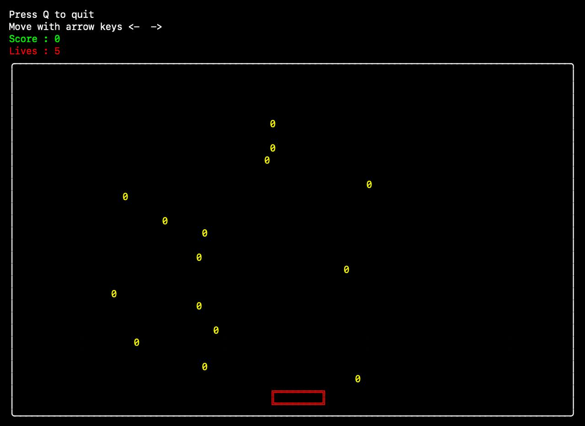

# Banana catch

---



---

- [Windows download](https://drive.google.com/file/d/1NdZitI1DVHUldrrp35ea2G572Z1zsXfC/view?usp=drive_link)
- [Mac OS (arm)](https://drive.google.com/file/d/1xxaDuHbiJ877wgPw7_hDi1oEWh8Fbm7T/view?usp=drive_link)

---

#### Development Prerequisites
- Rust compiler service

---

#### Development Setup
- Clone this repo
- Inside cloned repo ```cd banana_drop```
- ```cargo build```
- ```cargo run```


---

### Controls

- ```<-``` ```->``` Arrows keys to move left and right
- ```Q``` to quit the game
- ```R``` to Restart after death

---

### Power ups
- ```+``` Add extra live
- ```=``` Extends bowl width
- ```-``` Decreses bowl width
